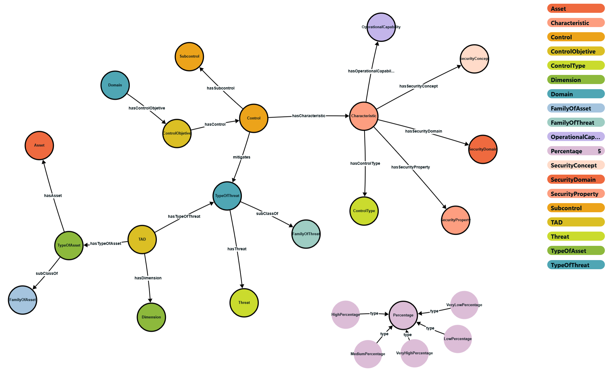

# ROMA: Risk Ontology for MARISMA

## Introduction

ROMA is an ontology designed for MARISMA, focusing on the sustainability and management of cybersecurity risks. ROMA incorporates the concepts from the MARISMA meta-pattern and serves as a foundational ontology that can be extended with specific patterns tailored to various application domains.

## Purpose

The primary purpose of ROMA is to provide a structured framework for defining and managing cybersecurity risks in a sustainable manner. It extends the core concepts of MARISMA to facilitate the creation of domain-specific ontologies for comprehensive risk management.

## Key Concepts

### Meta-Pattern Concepts
- **Characteristic**: Represents the properties or attributes of security controls.
- **Control**: Encompasses the measures or mechanisms put in place to mitigate risks.
- **SecurityProperty**: Defines the security attributes associated with controls.
- **SecurityConcept**: Broadly captures the various security-related notions.
- **SecurityDomain**: Categorizes the different areas within the security landscape.
- **OperationalCapability**: Reflects the effectiveness and efficiency of security controls.
- **Threat**: Identifies potential sources of harm or disruption.
- **TypeOfThreat**: Classifies threats into specific categories.
- **TAD (Threat, Asset, Dimension)**: Links threats with assets and their dimensions.
- **ControlObjective**: Articulates the goals that security controls aim to achieve.
- **Subcontrol**: Details the subcomponents of primary security controls.
- **Asset**: Represents valuable resources that need protection.
- **TypeOfAsset**: Categorizes assets into specific types.
- **Domain**: Defines the scope or area of focus within the security context.
- **Dimension**: Describes various facets or aspects related to threats and assets.
- **Percentage**: Quantifies the degree or extent of certain characteristics or properties.

## Extensibility

ROMA can be extended with domain-specific ontologies, allowing organizations to adapt the framework to their unique needs. Examples of possible extensions include:

- **MARISMA-CPS (Cyber-Physical Systems)**: Tailored for managing cybersecurity risks in CPS environments.
- **MARISMA-BIDA (Big Data)**: Focused on addressing risks associated with large-scale data processing and storage.

